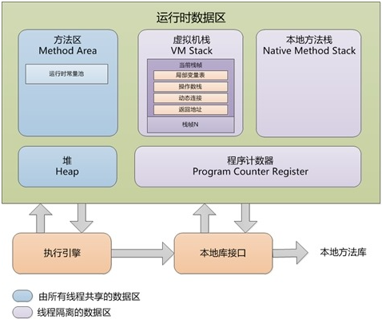

### 1.前言

> Java虚拟机在执行Java程序的过程中会把它所管理的内存划分为若干个不同的数据区域。这些区域有各自的用途，以及创建时间和销毁时间，有的区域随着虚拟机进程的启动而一直存在，有些区域则是依赖用户线程的启动和结束而建立和销毁。根据《Java虚拟机规范》的规定。Java虚拟机所管理的内存将会包括以下几个运行时数据区域。

### 2.程序计数器

  程序计数器（Program Counter Register）是一块较小的内存空间，它可以看做是当前线程所执行的字节码的行号指示器。在Java虚拟机的概念模型里，字节码解释器工作时就是通过改变这个计数器的值来选取下一条需要执行的字节码指令，它是程序控制流的指示器，分支、循环、跳转、异常处理、线程恢复等基础功能都需要依赖这个计数器来完成。

### 3.Java虚拟机栈

  与程序计数器一样，Java虚拟机栈（Java Virtual Machine Stack）也是线程私有的，它的生命周期与线程相同。虚拟机栈秒数的是Java方法执行的线程内存模型：每个方法被执行的时候，Java虚拟机都会同步创建一个栈帧（Stack Frame）用于存储局部变量表、操作数栈、动态连接、方法出口等信息。每一个方法被调用直到执行完毕的过程，就对应着一个栈帧在虚拟机中从入栈到出栈的过程。

### 4.本地方法栈

  本地方法栈（Native Method Stacks）与虚拟机栈所发挥的作用是非常相似的，其区别只是虚拟机栈为虚拟机执行Java方法（也就是字节码）服务，而本地方法栈则是为虚拟机使用到本地（Native）方法服务。

### 5.Java堆

  对于Java应用程序来说，Java堆（Java Heap）是虚拟机所管理的内存中最大的一块。Java堆是被所有线程共享的一块内存区域，在虚拟机启动时创建。此内存区域的唯一目的就是存放对象实例，Java世界里“几乎”所有的对象实例都在这里分配内存。在《Java虚拟机规范》中对Java堆的描述是：“所有的对象实例以及数组都应该在堆上分配”。

  Java堆是垃圾收集器管理的内存区域，因此也被称作“GC堆（Garbage Collected Heap）”。从回收内存的角度看，由于现代垃圾收集器大部分都是基于分代收集理论设计的，所以Java堆中经常会出现“新生代”、“老年代”、“永久代”、“Eden空间”、“From Survivor空间”、“To Survivor空间”等。

### 6.方法区

  方法区（Method Area）与Java堆一样，是各个线程共享的内存区域，它用于存储已被虚拟机加载的类信息、常量、静态变量、即时编器编译后的代码缓存等数据。

### 7.运行时常量池

  运行时常量池（Runtime Constant Pool）是方法区的一部分。Class文件中除了有类的版本、字段、方法、接口等描述信息外，还有一项信息常量池表（Constant Pool Table），用于存在编译期生成的各种字面量与符号引用，这部分内容将在类加载后存放到方法区的运行时常量池。

### 8.直接内存

  直接内存（Direct Memory）并不是虚拟机运行时数据区的一部分，也不是《Java虚拟机规范》中定义的内存区域。但是这部分内存也被频繁地使用，而且也可能导致OOM异常出现。