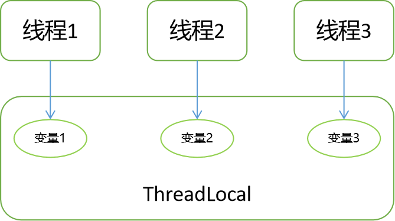

### 1.ThreadLocal简介

> This class provides thread-local variables. These variables differ from their normal counterparts in that each thread that accesses one (via its get or set method) has its own, independently initialized copy of the variable. ThreadLocal instances are typically private static fields in classes that wish to associate state with a thread (e.g., a user ID or Transaction ID).
> For example, the class below generates unique identifiers local to each thread. A thread's id is assigned the first time it invokes ThreadId.get() and remains unchanged on subsequent calls.

大致意思是，ThreadLocal提供线程局部变量，每个线程都有自己的，独立的初始化线程副本。当每个线程访问的时候，得到的都是线程自己的变量，这样就不会存在线程安全的问题。



### 2.ThreadLocal简单实例

开启两个线程，每个线程内部设置了本地变量，然后打印。

```java
public static void main(String[] args) {

        ThreadLocal<String> tl = new ThreadLocal<>();
        // 主线程的变量
        tl.set("main");

        new Thread(() -> {
            // 线程1的变量
            tl.set("thread1");
            System.out.println(tl.get());
        }).start();

        new Thread(() -> {
            // 线程2的变量
            tl.set("thread2");
            System.out.println(tl.get());
        }).start();

        System.out.println(tl.get());
    }
```

输出结果：

```
thread1
main
thread2
```

### 3.ThreadLocal的实现原理

#### 3.1ThreadLocal源码


#### 3.2Thread源码

